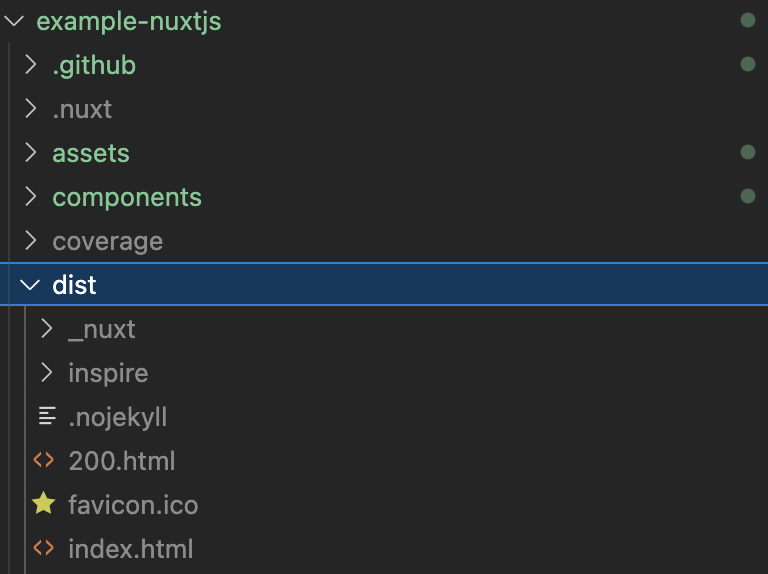
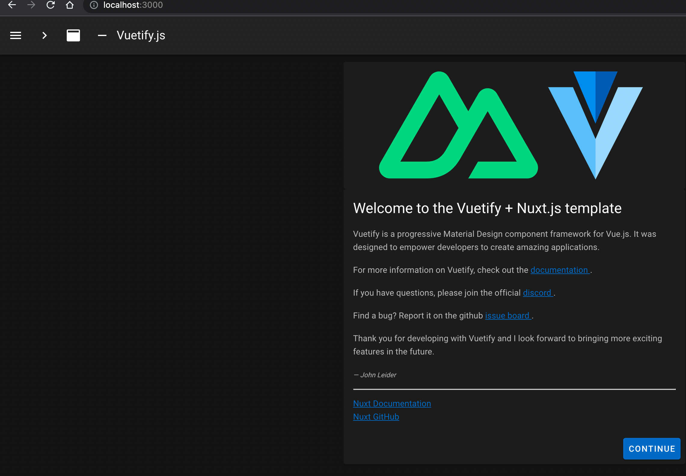

# Example Nuxt.js

> Nuxt.js is a free and open source JavaScript library based on Vue.js, Node.js, Webpack and Babel.js. Nuxt is inspired by Next.js, which is a framework of similar purpose, based on React.js. The framework is advertised as a "Meta-framework for universal applications"

- https://en.wikipedia.org/wiki/Nuxt.js

# (1) Setup

## NPM

### Mac

```bash
brew install npm
```

# (2) CI

## Check

```bash
$ npm run lintfix

> example-nuxtjs@1.0.0 lintfix
> prettier --write --list-different . && npm run lint:js -- --fix

README.md

> example-nuxtjs@1.0.0 lint:js
> eslint --ext ".js,.vue" --ignore-path .gitignore . --fix
```

This will format all your code files for you.

## Test

```bash
$ npm run test

> example-nuxtjs@1.0.0 test
> jest

 PASS  test/NuxtLogo.spec.js
  NuxtLogo
    ✓ is a Vue instance (6 ms)

---------------|---------|----------|---------|---------|-------------------
File           | % Stmts | % Branch | % Funcs | % Lines | Uncovered Line #s 
---------------|---------|----------|---------|---------|-------------------
All files      |       0 |      100 |     100 |       0 |                   
 components    |       0 |      100 |     100 |       0 |                   
  Tutorial.vue |       0 |      100 |     100 |       0 | 117-121           
 pages         |       0 |      100 |     100 |       0 |                   
  index.vue    |       0 |      100 |     100 |       0 | 82-86             
  inspire.vue  |       0 |      100 |     100 |       0 | 16-20             
---------------|---------|----------|---------|---------|-------------------
Test Suites: 1 passed, 1 total
Tests:       1 passed, 1 total
Snapshots:   0 total
Time:        1.218 s
Ran all test suites.
```

This will execute all the tests

## Build

```bash
$ npm run build
> example-nuxtjs@1.0.0 build
> nuxt build

ℹ Production build                                                                                                                                       06:23:11
ℹ Bundling only for client side                                                                                                                          06:23:11
ℹ Target: static                                                                                                                                         06:23:11
ℹ Using components loader to optimize imports                                                                                                            06:23:11
ℹ Discovered Components: .nuxt/components/readme.md                                                                                                      06:23:11
✔ Builder initialized                                                                                                                                    06:23:11
✔ Nuxt files generated                                                                                                                                   06:23:11

✔ Client
  Compiled successfully in 7.43s


Hash: 731323d655795d598f03
Version: webpack 4.46.0
Time: 7432ms
Built at: 12/09/2022 6:23:19 AM
                         Asset       Size   Chunks                                Chunk Names
../server/client.manifest.json   17.7 KiB           [emitted]                     
                    03a31ab.js  583 bytes        7  [emitted] [immutable]         pages/inspire
                    2f0748b.js  820 bytes        5  [emitted] [immutable]         components/vuetify-logo
                    79c9f05.js    213 KiB        2  [emitted] [immutable]         commons/app
                    7a6f2af.js   12.5 KiB        0  [emitted] [immutable]         vendors/pages/index/pages/inspire
                    94cbfba.js    483 KiB        9  [emitted] [immutable]  [big]  vendors/app
                      LICENSES  336 bytes           [emitted]                     
                    bdf0bf0.js   2.35 KiB        8  [emitted] [immutable]         runtime
                    c2aeb26.js   6.63 KiB        4  [emitted] [immutable]         components/tutorial
                    d54bb82.js   1.83 KiB        3  [emitted] [immutable]         components/nuxt-logo
                    e78a8b7.js   20.2 KiB  6, 3, 5  [emitted] [immutable]         pages/index
                    fc6dd4f.js   46.8 KiB        1  [emitted] [immutable]         app
 + 1 hidden asset
Entrypoint app = bdf0bf0.js 79c9f05.js 94cbfba.js fc6dd4f.js

WARNING in asset size limit: The following asset(s) exceed the recommended size limit (244 KiB).
This can impact web performance.
Assets: 
  94cbfba.js (483 KiB)
ℹ Generating output directory: dist/                                                                                                                     06:23:19
ℹ Generating pages                                                                                                                                       06:23:19
✔ Generated route "/inspire"                                                                                                                             06:23:19
✔ Generated route "/"                                                                                                                                    06:23:19
✔ Client-side fallback created: 200.html  
```

This builds the optimized web package under dist:



# (3) Running it

```bash
$ npm run dev


   ╭───────────────────────────────────────╮
   │                                       │
   │   Nuxt @ v2.15.8                      │
   │                                       │
   │   ▸ Environment: development          │
   │   ▸ Rendering:   client-side          │
   │   ▸ Target:      server               │
   │                                       │
   │   Listening: http://localhost:3000/   │
   │                                       │
   ╰───────────────────────────────────────╯

ℹ Preparing project for development                                                                                                                      06:12:40
ℹ Initial build may take a while                                                                                                                         06:12:40
ℹ Discovered Components: .nuxt/components/readme.md                                                                                                      06:12:40
✔ Builder initialized                                                                                                                                    06:12:40
✔ Nuxt files generated                                                                                                                                   06:12:40

✔ Client
  Compiled successfully in 2.59s

ℹ Waiting for file changes                                                                                                                               06:12:43
ℹ Memory usage: 255 MB (RSS: 523 MB)                                                                                                                     06:12:43
ℹ Listening on: http://localhost:3000/
```

You can then open http://localhost:3000/ in the browser:



# FAQ

## How did I generate this project?

```bash
$ npm init nuxt-app@latest example-nuxtjs


create-nuxt-app v5.0.0
✨  Generating Nuxt.js project in example-nuxtjs-tmp
? Project name: example-nuxtjs
? Programming language: JavaScript
? Package manager: Npm
? UI framework: Vuetify.js
? Template engine: HTML
? Nuxt.js modules: (Press <space> to select, <a> to toggle all, <i> to invert selection)
? Linting tools: ESLint, Prettier
? Testing framework: Jest
? Rendering mode: Single Page App
? Deployment target: Server (Node.js hosting)
? Development tools: (Press <space> to select, <a> to toggle all, <i> to invert selection)
? Continuous integration: GitHub Actions (GitHub only)
? What is your GitHub username? jvalentino
? Version control system: Git
```
